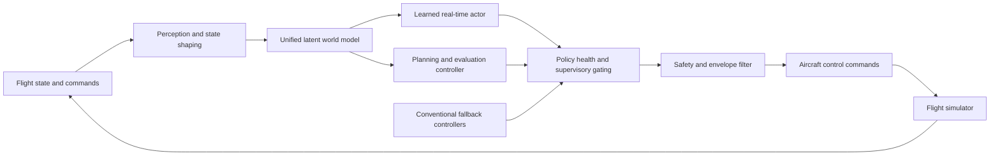

# Hypersonic Pilot

## Safety-Supervised World-Model Flight Control Research

Hypersonic Pilot is an independent aerospace autonomy research project investigating model-based reinforcement learning, latent world models, robust flight control, system identification, and runtime assurance for transonic and supersonic aircraft.

The project combines a learned latent world model with conventional flight control, runtime monitoring, and fallback control. The current research focuses on transonic and supersonic flight within the credible operating envelope of the available simulator. It does not claim validated hypersonic flight performance or readiness for real aircraft.

> This is a public research overview. The implementation, trained weights,
> detailed safety configuration, and training infrastructure remain private.

## Research Areas

- Autonomous flight and high-speed aerospace control
- Model-based reinforcement learning and Dreamer-style agents
- Latent world models and short-horizon dynamics prediction
- Robust control, runtime assurance, and fallback systems
- Aerospace simulation and flight-envelope protection
- System identification, uncertainty estimation, and fault injection

## Research Question

Can a unified learned world model capture enough of the nonlinear interaction
between aircraft state, atmosphere, propulsion, and multiple control surfaces
to support robust control across a broad flight envelope?

The work tests more than task reward. It separately measures:

- closed-loop control performance;
- predicted response to control-surface sweeps;
- lateral and longitudinal cross-coupling;
- short-horizon world-model fidelity across Mach and altitude;
- behavior near structural, aerodynamic, and thermal boundaries;
- compatibility with deterministic safety and fallback layers.

## Conceptual Architecture



The design is inspired by biological division of labor, but the labels are
engineering abstractions rather than claims of biological fidelity.

## Physical Grounding

The simulator and evaluation layer explicitly represent relationships such as:

```text
dynamic pressure:       q = 0.5 * gamma * P * Mach^2
required lift:          CL = nz * (W/S) / q
specific energy height: He = h + V^2 / (2g)
```

Atmospheric density, aerodynamic heating, Reynolds number, lift margin, and
Mach-dependent control effectiveness are also represented. Learned behavior is
compared with these physical quantities and with the underlying flight
simulator; reward alone is not treated as proof that the model learned physics.

## June 2026 Research Snapshot

The latest private simulation run tested a unified Dreamer-style world model
with a gray-box residual head trained over short rollouts. The evaluation
compared two controllers using the same learned model:

- an amortized actor intended for real-time control;
- an MPPI-style planner intended for slower evaluation and counterfactual
  search.

The result is useful, but deliberately not overstated. The planner passed the
current sweep/coupling gates; the real-time actor did not. The residual model
learned useful one-step corrections, but it still did not beat the hand-coded
physics baseline over full open-loop EDGE rollouts.

| Measure | Latest public-safe result |
|---|---:|
| Actor mean return, selected checkpoint | +1640.2 |
| Actor worst sweep ratio | 0.563, below 0.6 gate |
| Planner mean return, selected checkpoint | +1146.6 |
| Planner worst sweep ratio | 0.699, passes 0.6 gate |
| Planner coupling score | 0.500, passes 0.4 gate |
| Final-checkpoint planner mean return | +1363.6 |
| Final-checkpoint planner worst sweep ratio | 0.686 |
| EDGE one-step gray-box vs physics | gray-box better |
| EDGE full-rollout gray-box vs physics | gray-box worse |

The current evidence supports a planner-first research direction: the learned
world model is useful for planning and analysis, while the real-time actor
still needs distillation or additional robustness training before promotion.
See [STATUS_JUNE_2026.md](STATUS_JUNE_2026.md) for the bounded public status
note.

## What Was Tested

The latest verdict used three categories of tests:

1. **Closed-loop controller evaluation**: actor and planner were flown through
   the same simulator cells and scored for return, longitudinal response, and
   lateral coupling.
2. **Physics-grounded response probes**: the model was checked against
   sweep-response behavior rather than reward alone.
3. **Open-loop generalization-law tests**: physics-only, neural decoder-only,
   and gray-box residual predictors were compared on dynamic channels across
   interior and held-out edge cells.

The gray-box residual head improved over the pure neural decoder by a large
margin, and it beat the physics baseline at one-step EDGE prediction. However,
when rolled forward for the full horizon, its residual corrections accumulated
drift. That is why this project does not claim broad discovery of a better
general flight equation.

## Current Research Phase

The active phase is focused on turning useful short-horizon learned corrections
into stable long-horizon behavior. The main technical directions are:

- robustness-first checkpoint selection rather than raw-return selection;
- MPPI-to-actor distillation, because planning passes where the actor fails;
- rollout-stability losses for the gray-box residual head;
- error-driven curriculum over physically feasible weak Mach-altitude cells;
- uncertainty-aware policy authority inside the runtime assurance stack.

Next evaluation stages include:

1. repeat actor and planner verdicts after checkpoint-selection updates;
2. compare MPPI-distilled actor behavior against the current actor;
3. test whether rollout-stability training reduces EDGE full-horizon drift;
4. run full runtime integration through the supervisory safety stack;
5. run sensor and actuator fault-injection campaigns.

## Scope And Limitations

- The current teacher is a simulation model, not flight-test data.
- The credible present scope is primarily transonic and supersonic flight.
- Results beyond approximately Mach 2.2 require higher-fidelity aerodynamic
  and thermal data before strong claims are appropriate.
- No software or result in this repository is certified for safety-critical
  use.
- Public metrics are research snapshots and may change as evaluation methods
  become stricter.

## Project Status

Active private development, simulation, and GPU training are underway. Public
updates will describe research milestones without publishing security-sensitive
or proprietary implementation details.

## Collaboration

Discussion is welcome around model-based reinforcement learning, flight-control
evaluation, system identification, uncertainty estimation, runtime assurance,
and high-fidelity aerospace simulation. Please use this repository's GitHub
Issues or Discussions for research-oriented contact.

## Follow The Project

- **Star** the repository to support the research and find future updates.
- **Watch** repository activity for new public evaluation milestones.
- Use **GitHub Issues** or **Discussions** to share related research and collaboration ideas.

## Availability

This repository is documentation-only and is **not an open-source software
release**. All implementation code, model weights, datasets, configurations,
and unpublished results are reserved by the project author.
