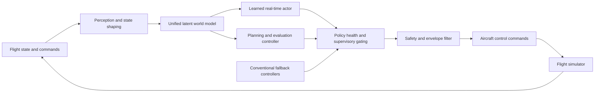

# Hypersonic Pilot

## Safety-Supervised World-Model Flight Control Research

Hypersonic Pilot is an independent aerospace autonomy research project investigating model-based reinforcement learning, latent world models, robust flight control, system identification, and runtime assurance for transonic and supersonic aircraft.

The project combines a learned latent world model with conventional flight control, runtime monitoring, and fallback control. The current research focuses on transonic and supersonic flight within the credible operating envelope of the available simulator. It does not claim validated hypersonic flight performance or readiness for real aircraft.

> This is a public research overview. The implementation, trained weights,
> detailed safety configuration, and training infrastructure remain private.

## Research Areas

- Autonomous flight and high-speed aerospace control
- Model-based reinforcement learning and Dreamer-style agents
- Latent world models and short-horizon dynamics prediction
- Robust control, runtime assurance, and fallback systems
- Aerospace simulation and flight-envelope protection
- System identification, uncertainty estimation, and fault injection

## Research Question

Can a unified learned world model capture enough of the nonlinear interaction
between aircraft state, atmosphere, propulsion, and multiple control surfaces
to support robust control across a broad flight envelope?

The work tests more than task reward. It separately measures:

- closed-loop control performance;
- predicted response to control-surface sweeps;
- lateral and longitudinal cross-coupling;
- short-horizon world-model fidelity across Mach and altitude;
- behavior near structural, aerodynamic, and thermal boundaries;
- compatibility with deterministic safety and fallback layers.

## Conceptual Architecture



The design is inspired by biological division of labor, but the labels are
engineering abstractions rather than claims of biological fidelity.

## Physical Grounding

The simulator and evaluation layer explicitly represent relationships such as:

```text
dynamic pressure:       q = 0.5 * gamma * P * Mach^2
required lift:          CL = nz * (W/S) / q
specific energy height: He = h + V^2 / (2g)
```

Atmospheric density, aerodynamic heating, Reynolds number, lift margin, and
Mach-dependent control effectiveness are also represented. Learned behavior is
compared with these physical quantities and with the underlying flight
simulator; reward alone is not treated as proof that the model learned physics.

## Interim Evidence

The latest archived evaluation supports continuing the research direction:

| Measure | Current evidence |
|---|---:|
| Learned actor, ten-episode mean return | +1632.9 |
| Planning controller, ten-episode mean return | +1064.3 |
| Worst longitudinal response ratio | 0.700 |
| Measurable lateral-coupling score | 0.500 |
| Mean short-horizon error in feasible cells | 0.0662 |
| 90th-percentile error in feasible cells | 0.0904 |

These results indicate useful learned dynamics and control, but they do not
establish exact equation discovery. Response magnitudes still show calibration
error, some lateral probes remain unobservable, and long-horizon aggressive
maneuvers require further testing.

## Current Research Phase

The active phase uses error-driven curriculum learning. Prediction-error maps
identify weak but physically feasible Mach-altitude regions, which are sampled
more often during the next training run. Conditions beyond structural or
thermal limits remain stress tests and are not promoted as normal training
targets.

Next evaluation stages include:

1. repeat actor, planner, and fidelity-map comparisons;
2. full runtime integration through the supervisory safety stack;
3. sensor and actuator fault-injection campaigns;
4. uncertainty-aware policy authority;
5. physics-based dynamics with a learned residual model.

## Scope And Limitations

- The current teacher is a simulation model, not flight-test data.
- The credible present scope is primarily transonic and supersonic flight.
- Results beyond approximately Mach 2.2 require higher-fidelity aerodynamic
  and thermal data before strong claims are appropriate.
- No software or result in this repository is certified for safety-critical
  use.
- Public metrics are research snapshots and may change as evaluation methods
  become stricter.

## Project Status

Active private development, simulation, and GPU training are underway. Public
updates will describe research milestones without publishing security-sensitive
or proprietary implementation details.

## Collaboration

Discussion is welcome around model-based reinforcement learning, flight-control
evaluation, system identification, uncertainty estimation, runtime assurance,
and high-fidelity aerospace simulation. Please use this repository's GitHub
Issues or Discussions for research-oriented contact.

## Follow The Project

- **Star** the repository to support the research and find future updates.
- **Watch** repository activity for new public evaluation milestones.
- Use **GitHub Issues** or **Discussions** to share related research and collaboration ideas.

## Availability

This repository is documentation-only and is **not an open-source software
release**. All implementation code, model weights, datasets, configurations,
and unpublished results are reserved by the project author.
